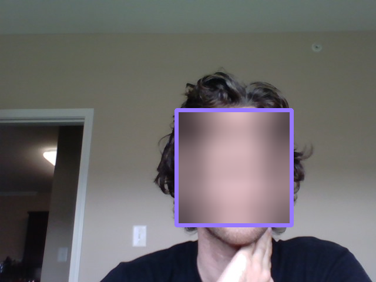
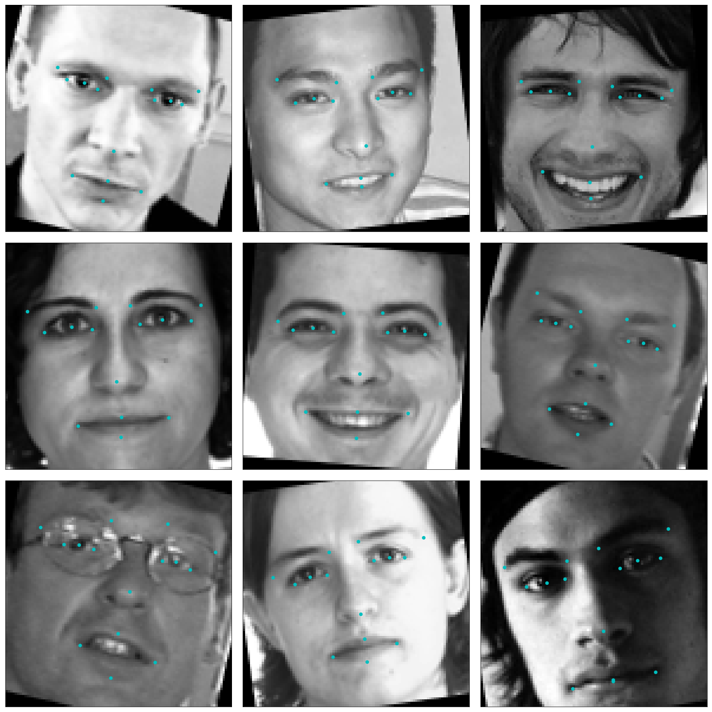
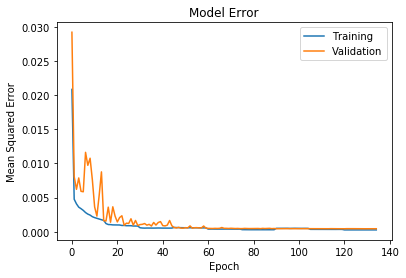
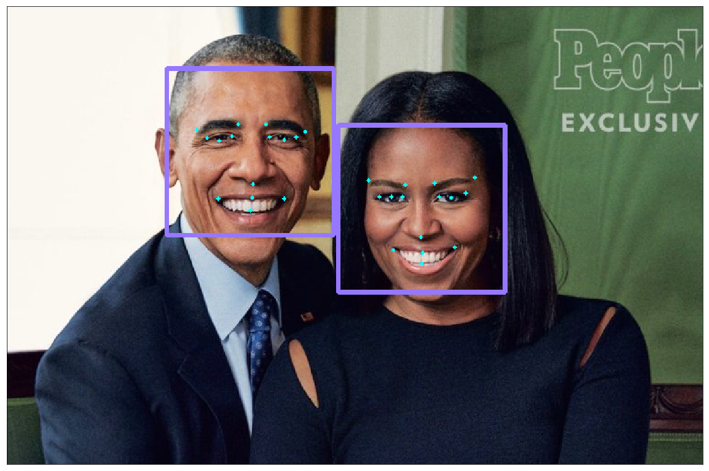
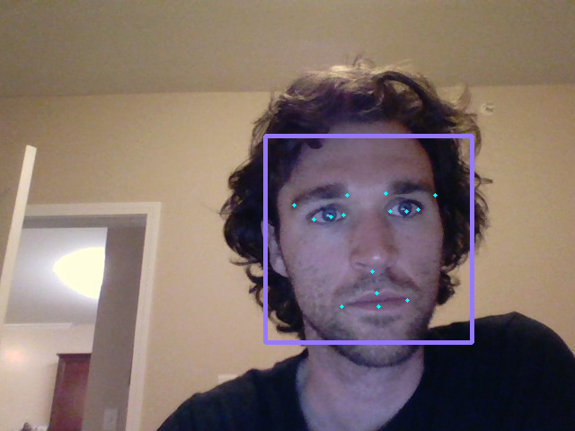
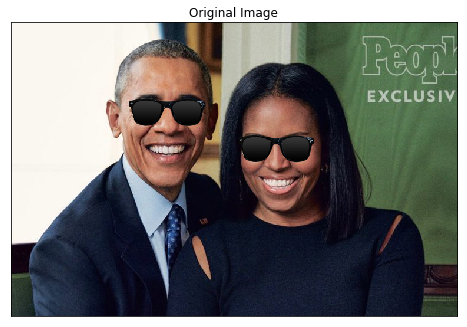

<u><h1>Facial Keypoint Detector - Project Summary</h1></u>

<h2>Face Detection and Blurring with OpenCV</h2>

<h2>Data Augmentation for Images and Keypoint Labels- Flipping, Scaling, and Rotation</h2>

<h2>Trained Keypoint Detection Model</h2>
<h3>Training curves of the model</h3>

<h3>Keypoint predictions placed on original images.</h3>

<h2>Sunglasses Filter</h2>

